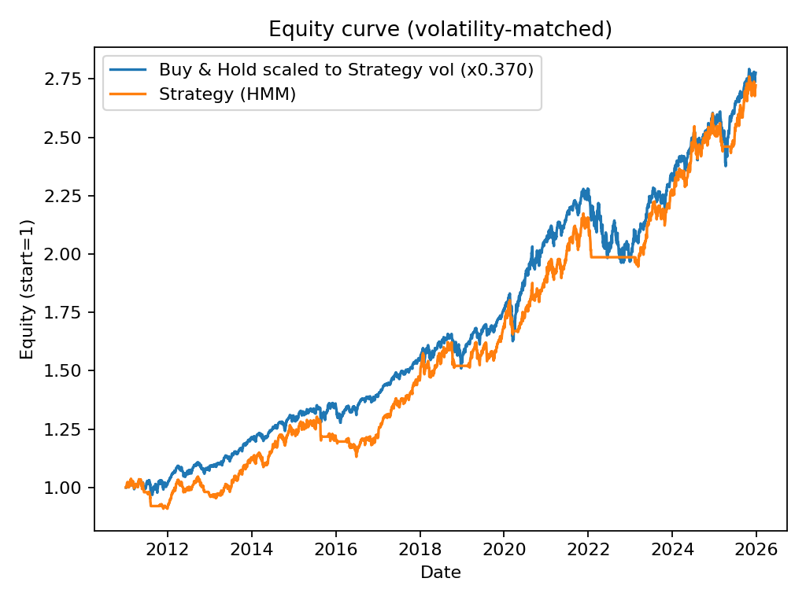
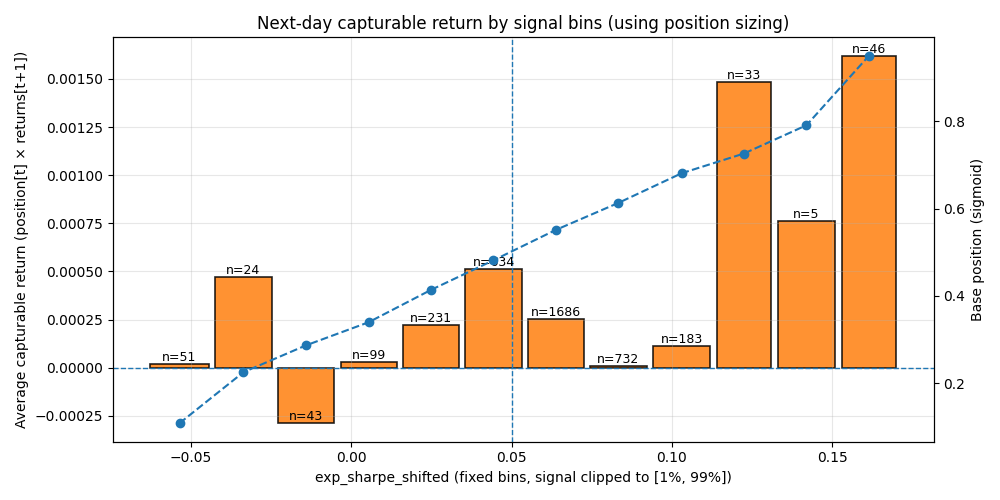

# Hidden-Markov-Regime-Strategy

Quantitative trading framework based on **Hidden Markov Models (HMM)** for market regime identification, with an emphasis on **out-of-sample validation**, **robustness testing**, and **risk-adjusted performance**.

This project implements a full research pipeline including:

- Walk-forward training (no look-ahead bias)
- Block bootstrap Monte Carlo inference
- Deflated Sharpe Ratio (DSR) to account for data-snooping
- Volatility-matched benchmarking against Buy & Hold

The objective is not to maximize raw returns, but to construct a **statistically defensible strategy with controlled downside risk**.

### Drawdown

### Volatility-matched Equity Curve

### Capturable Forward Returns

## Signal vs Forward Returns

  

---

## Methodology

Financial markets exhibit regime-dependent behavior, where risk and return characteristics change over time.  
This project builds a regime-aware trading strategy on QQQ using a multivariate Hidden Markov Model to infer latent market states and dynamically adjust exposure.
The strategy prioritizes:

- Stability over aggressiveness
- Risk-adjusted performance over absolute returns
- Robust validation over in-sample optimization

---

## Signal Construction

### Regime Detection
- Multivariate Gaussian HMM  
- Trained using an expanding walk-forward window  
- No parameter look-ahead or leakage  
- Latent regimes inferred daily  

### Signal Definition
- For each regime, estimate expected return and volatility  
- Compute an ex-ante expected Sharpe ratio using predictive regime probabilities  
- Apply exponential smoothing to reduce estimation noise  
- Shift the signal to ensure strictly forward-looking (ex-ante) usage  
- Map expected Sharpe to position size via a sigmoid function  

---

## Risk Management

- Trend filter: EMA fast vs EMA slow  
- Volatility targeting: normalize risk across regimes and time  

---

### Portfolio Output

- Continuous exposure between 0 and 1.35
- Daily strategy returns
- Equity curve and drawdown tracking

---

## Validation Methodology

This project explicitly avoids in-sample-only evaluation.

## Results Summary

- Raw returns do not outperform Buy & Hold, as expected due to reduced market exposure  
- At matched volatility, the strategy achieves comparable performance to Buy & Hold  
- Maximum drawdowns are significantly reduced, particularly during crisis periods (2020, 2022)  

---

## Validation

### Walk-Forward Backtest
- Model retrained yearly using only past data  
- Strategy applied strictly out-of-sample  

### Block Bootstrap Monte Carlo
- Stationary block bootstrap to preserve serial dependence  
- Empirical distributions of Sharpe, CAGR, volatility and maximum drawdown  

### Deflated Sharpe Ratio (DSR)
- Adjusts Sharpe significance for non-normal returns and multiple trials  

---
## Limitations

- Daily close-to-close execution only  
- Transaction costs and slippage not explicitly modeled  
- Regime stability may degrade during structural breaks  

---
## Predictive Diagnostics
The project includes explicit diagnostics to evaluate whether the regime-based signal contains forward-looking information.

These diagnostics are not used for optimization, but for validation and interpretability.

Lag Analysis
Correlation between the ex-ante expected Sharpe signal and future returns is evaluated across multiple lags.
This helps identify the time horizon where regime information is most informative.

Signal Bucketing
Forward returns are analyzed conditional on signal strength:
- Weak signal regimes
- Neutral regimes
- Strong signal regimes

Both raw forward returns and capturable returns (position × forward return) are evaluated.

All diagnostics are generated automatically and saved to:
reports/figures/

---

## Results Summary

- Raw returns do not outperform Buy & Hold, as expected due to reduced market exposure.
- At matched volatility, the strategy achieves **comparable performance** to Buy & Hold.
- Maximum drawdowns are **significantly reduced**, particularly during crisis periods (2020, 2022).
- Block bootstrap Monte Carlo confirms robustness across resampled paths.
- Deflated Sharpe Ratio remains **statistically significant** after accounting for data-snooping.

The primary value of the strategy lies in **drawdown mitigation and risk control**, not in return amplification.

---

## Visual Analysis

All figures are saved under:

reports/figures/

---

## Project Structure

src/
    hmm_strategy.py
    bootstrap.py
    deflated_sharpe.py
    export_figures.py

reports/
    figures/
        equity_raw.png
        equity_vol_matched.png
        drawdown.png

---

## How to Run

python src/hmm_strategy.py
python src/bootstrap.py
python src/deflated_sharpe.py
python src/export_figures.py

---

## Disclaimer

This project is for research and educational purposes only.  
It does not constitute financial advice.

